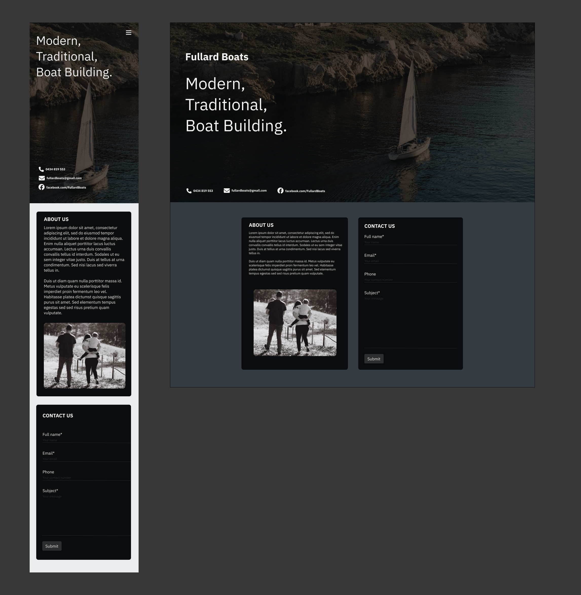
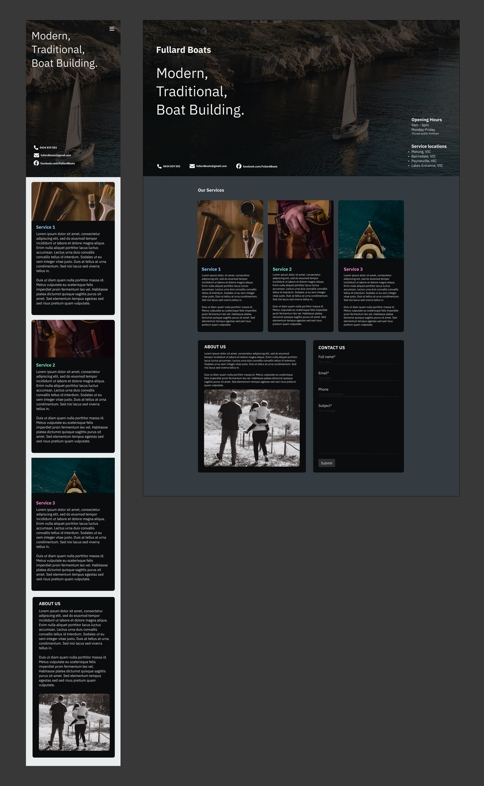
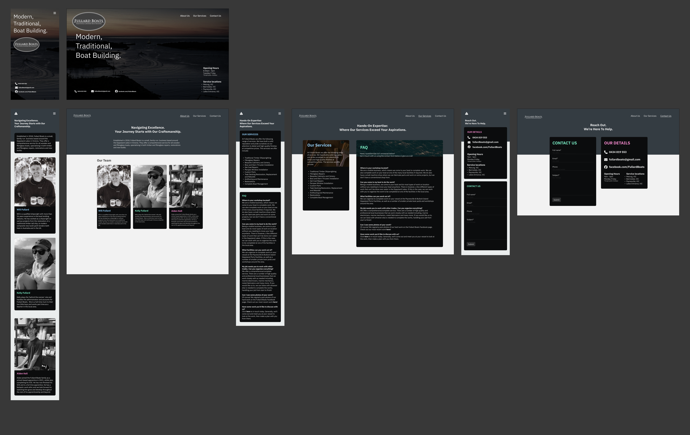

# Fullard Boats website Readme

## Website URL:

https://www.fullardboats.com.au/

## Client's Background:
Established in 2018, Fullard Boats is a small, family-run business based around the Gippsland Lakes in Victoria. They offer a comprehensive service for all wooden and fibreglass boats, specialising in both timber and fibreglass repairs, restorations and new builds.

## Purpose:
The purpose of this product is to showcase who they are as a business, the services that Fullard Boats has to offer and a way of contacting them.  

## Functionality / Features:
This website has four main pages. The landing page introduces the user with the Fullard Boats tagline, their logo and information about their location as well as contact information which is easy to read. This offers the user immediate information about the business before needing to click onto other pages. The 'About Us' page offers a brief history of the business and a card for all three people who work for the business which details who they are and what specialty they offer. The 'Our Services' page details exactly how vast their services are and contains an FAQ section. The 'Contact Us' page of the website contains a contact form. Upon filling out the form and clicking submit, Fullard Boats will receive an email containing the information for each field of the form. The form has 4x fields: 

- Full name
- Email
- Phone(optional)
- The message the user wishes to send.

## Target Audience:
The target audience for this website are existing or potential clients. This website provides all of the information they require to get a great understanding of what the business offers and multiple methods of contact.

## User Stories:

1. As a visitor to the Fullard Boats website, I want to quickly understand what Fullard Boats does and how to contact them, so I can decide if their services are relevant to my needs.

2. As a potential customer, I want to learn about the history and background of Fullard Boats, so I can feel confident in their experience and expertise.

3. As a boat owner needing specific services, I want to see a detailed list of the services Fullard Boats offers, so I can determine if they provide the repairs or restorations I need.

4. As a curious visitor, I want to read the FAQ section on the 'Our Services' page, so I can quickly find answers to common questions without having to contact the business directly.

5. As a mobile user, I want the website to be optimised for mobile devices, so I can easily navigate and access information from my smartphone or tablet.

## Designs:

### Version 1:
As the client had no initial preferences on how the website looked, a single page design was mocked up to spark ideas. This design features a clear image of a boat on the water with two separate sections dedicated to displaying who the business is, and a contact form.

### Version 2:
The client provided feedback and wished to add some information about some of the core services they offer. This version shows a single page with the existing information as well as an additional section with some core services.

### Version 3:
The client provided more feedback and requested that the website is broken up into several different pages so they can expand on each element. This design allows for multiple pages: The landing page, About Us page, Our Services page and Contact Us page. The landing page is designed to be easy to view with the information about who the business is and their contact information. The other pages have been populated with real content as the client was able to provide it at this stage. We can see the website taking shape clearly outlining their services and who each employee is. This also saw the introduction of a brighter header as requested by the client. 

### Version 4:
This version is the final draft which tweaked some minor things such as the way the contact page looks and a darker header as requested by the client. The image used in the landing page is now an image from the local that the business operates

## 

## Tech Stack & Application Architecture Diagram:
The website will utilise a modern tech stack to deliver a seamless and responsive user experience:

Front-end: React.js
 
Back-end: Node.js, Express.js
 
Hosting: Netlify (frontend), render.com (backend), Ventraip (domain name)

